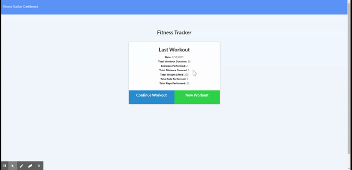

# Exercise Tracker App

## About the Project
This project was intended to be a first attempt at implementing the back-end of a full-stack application using MongoDB. This app was built in Node using the Mongoose node package. All front-end code was provided. All back-end code was made by me.

## Challenges
It was more difficult that I had anticipated to create the back-end code without having hand in creating the front-end code. It took some time to fully comprehend the struture and logic of the front-end enough to have a successful back-end up and running.

The stats.js file provided to me had a few glaring bugs which led to a period of time questioning my back-end logic only to find out that the code provided for this project was flawed. I did, however, enjoy digging into Chart.js to fix this (some really neat stuff). 

## Link to Deployed Application:
https://exercise-tracker-cjc.herokuapp.com/

## Link to GitHub Repository:
https://github.com/carlschr/exercise-app

## Preview of Application:
